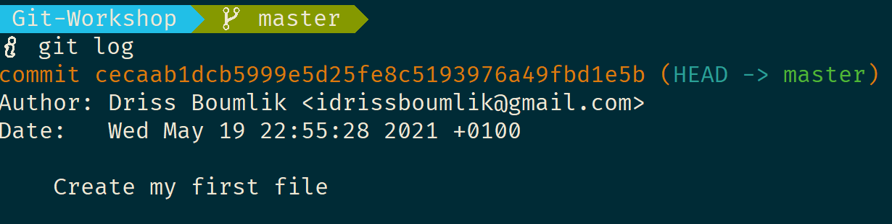
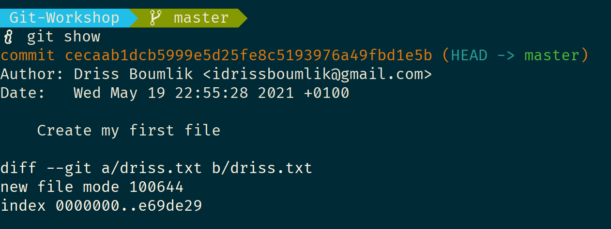
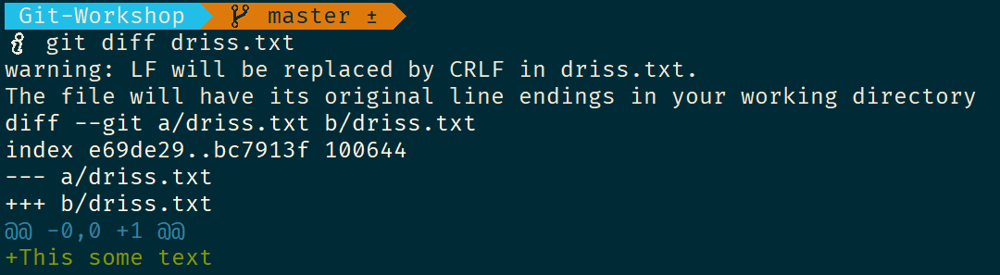
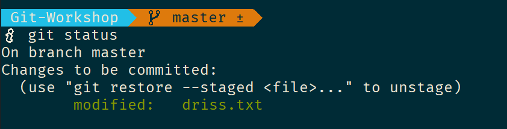
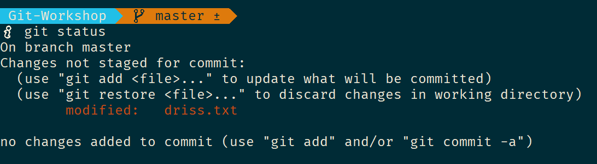

# __Git-Workshop__

## _Installation_

---
Check this link to know more about git : <http://git-scm.com/about>

Download & install git from <http://git-scm.com/>

## _Configuration_

---

First thing you need to do is to identify yourself

    > git config --global user.name "Your Name"
    > git config --global user.email your.email@example.com

## _Github - Create an account_

---

Go to <https://github.com> and create an account so you'll be able to contribute to the remote workshop git repository.

## _Here we GO_

---

First, clone this repository:

    > git clone git@github.com:teacodema/Git-Workshop.git
    > cd Git-Workshop
    > ls

To see the gir -hidden- subdirectory try this :

    > ls -a

### _The Staging area_

---

We will start by creating a file with your [firstname] as the name of the file

    > touch [firstname].txt

Let's add the change to the staging area

    > git add [firstname].txt

### _Committing the changes_

---

Now, let's commit the message using this command (simple version)

    > git commit -m "Create my first file"

### _The log_

---

Git allows us to see what happend using this command

    > git log

the result should like this

    commit cecaab1dcb5999e5d25fe8c5193976a49fbd1e5b (HEAD -> master)
    Author: Driss Boumlik <idrissboumlik@gmail.com>
    Date:   Wed May 19 22:55:28 2021 +0100

        Create my first file

    > git show [file name]

The result should be something like

    commit cecaab1dcb5999e5d25fe8c5193976a49fbd1e5b (HEAD -> master)
    Author: Driss Boumlik <idrissboumlik@gmail.com>
    Date:   Wed May 19 22:55:28 2021 +0100

        Create my first file

    diff --git a/driss.txt b/driss.txt
    new file mode 100644
    index 0000000..e69de29

Let's modify your file again, open your file and add some text:

e.g. "Some random text".

To see what changed, you can use this command (don't commit or even add the changes to the staging area.)

    > git diff [file name]

The result should be something like

    diff --git a/driss.txt b/driss.txt
    index e69de29..bc7913f 100644
    --- a/driss.txt
    +++ b/driss.txt
    @@ -0,0 +1 @@
    +This some text

Now let’s add our modified file, alice.txt to the staging area. Do you remember how ?

Next, check the status of [firstname].txt. Is it in the staging area now?

Commit the file with this message "Add first content changes"
You can use the log/show git commands to the commits/changes

### Lets make mistakes - Undo changes 1

---
In this section, we are going to add more changes, and try to recover from mistakes.

Be forewarned, this next step is going to be hard. We will need to add some content to [firstname].txt.
Open your file and add more content (your favorite language for example).

Add the file to the staging area, then check it if everything works.

    > git status

You should see this

    On branch master
    Changes to be committed:
        (use "git restore --staged <file>..." to unstage)
                modified:   driss.txt

Now, let's say we did a mistake with the added text, we can undo the changes like this:

    > git reset HEAD [firstname].txt

or

    > git restore --staged [firstname].txt

Check again with

    > git status

You should see this

    On branch master
    Changes not staged for commit:
        (use "git add <file>..." to update what will be committed)
        (use "git restore <file>..." to discard changes in working directory)
                modified:   driss.txt

    no changes added to commit (use "git add" and/or "git commit -a")

Did we lost the content we added ?
Of course not, the content is still there and we can fix the mistakes we made.

### Lets make mistakes - Undo changes 2

---

Let's say we want to discard the changes and get back to the first state before adding the changes.

    > git checkout [firstname].txt

### Update your copy

---

Each time you verify/add/commit your changes , you need to do this

    > git pull origin main
    
    > git push origin main

This will allow you to download updates of your collaborators and the github repository so others can download them.

### Branching

---

Now lets see the branches we have

    > git branch

The * should indicate the current branch you are on, which is master.

If you like to make a new branch, here is how:

    > git branch [branch name]

to switch to the new branch you will need this:

    > git checkout [branch name]

We also can create and checkout to the new branch like this:

    > git checkout -b [branch name]

Let's create a new branch with this format [firstname]_branch

    > git checkout -b driss_branch

Now verify that you created & switched successfully to the new branch

    > git branch
    
    * driss_branch
      master

Now let’s work in that branch :

    > echo 'some content' > test.txt
    > git add test.txt
    > git commit -m "Added experimental txt"

Now, let’s compare them to the master branch. Use git diff

    > git diff master

Basically what the above output says is that test.txt is present on the [firstname]_branch branch, but is absent on the master branch.

### Now you see me, now you don’t

---

Git is good enough to handle your files when you switch between
branches. Switch back to the `master` branch

Try switching back to the master branch

Now, where’s our `test.txt` file ?

    > ls

As you can see the new file you created in the other branch has
disappeared. Not to worry, it is safely tucked away, and will re-appear
when you switch back to that branch.

Now, switch back to the [firstname]_branch branch, and check that the `test.txt` is
now present.

### Merging

---

We now try out merging. Eventually you will want to merge two branches
together after the conclusion of work.\
`git merge` allows you to do that.

Git merging works by first switching the branch you want to *into*, and
then running the command to merge the other branch in.

We now want to merge our `[firstname]_branch` branch into `master`. First, switch to
the `master` branch.

    > git checkout master

Next, we merge the `[firstname]_branch` branch into `master` :

    > git merge [firstname]_branch

Do you see the following output ?

    Merge made by recursive.
     test.txt |    1 +
     1 files changed, 1 insertions(+), 0 deletions(-)
     create mode 100644 test.txt

At this point, you can also try out `gitk` to visualize the changes and how the two branches have merged

Merge Conflicts

---

Git is pretty good at merging automagically, even when the same file is
edited. There are however, some situations where the same line of code
is edited there is no way a computer can figure out how to merge.\
This will trigger a conflict which you will have to fix.

We now practise fixing merge conflicts. Recall that conflicts are caused
by merges which affect the same block of code.

Here’s a branch I prepared earlier. The branch is called `[firstname2]_branch`. Run
the code below to set it up (don’t worry if you can’t understand it)

    > git checkout [firstname2]_branch

You should now have a new branch called `[firstname2]_branch`. Try merging that
branch into `master` now and fix the ensuing conflict.

Fixing a conflict

---

You should see a `conflict` with the `[firstname2].txt` file. This means that
the same line of text was edited and committed on both the master branch
and the [firstname2]_branch branch. The output below basically tells you the current
situation :

    Auto-merging [firstname2].txt
    CONFLICT (content): Merge conflict in [firstname2].txt
    Automatic merge failed; fix conflicts and then commit the result.

If you open the `[firstname2].txt` file, you will see something similar as
below:

    > cat [firstname2].txt

Git uses pretty much standard conflict resolution markers. The top part
of the block, which is everything between `<<<<<< HEAD` and `======` is
what was in your current branch.\
The bottom half is the version that is present from the `[firstname2]_branch` branch.
To resolve the conflict, you either choose one side or merge them as you
see fit.

For example, I might decide to choose the version from the `[firstname2]_branch`
branch.

Now, try to **fix the merge conflict**. Pick the text that you think is
better (Ask for help if stumped)

Once I have done that, I can then mark the conflict as fixed by using
`git add` and `git commit`.

    > git add [firstname2].txt
    > git commit -m "Fixed conflict"

Congratulations. You have fixed the conflict. All is good in the world.

## _Github_

---

We will be doing the same thing on github (I mean fixing conflicts).
First you need to push your branch in order to create merge request and merge your branche with the main branch.

Thank you for making it this far
